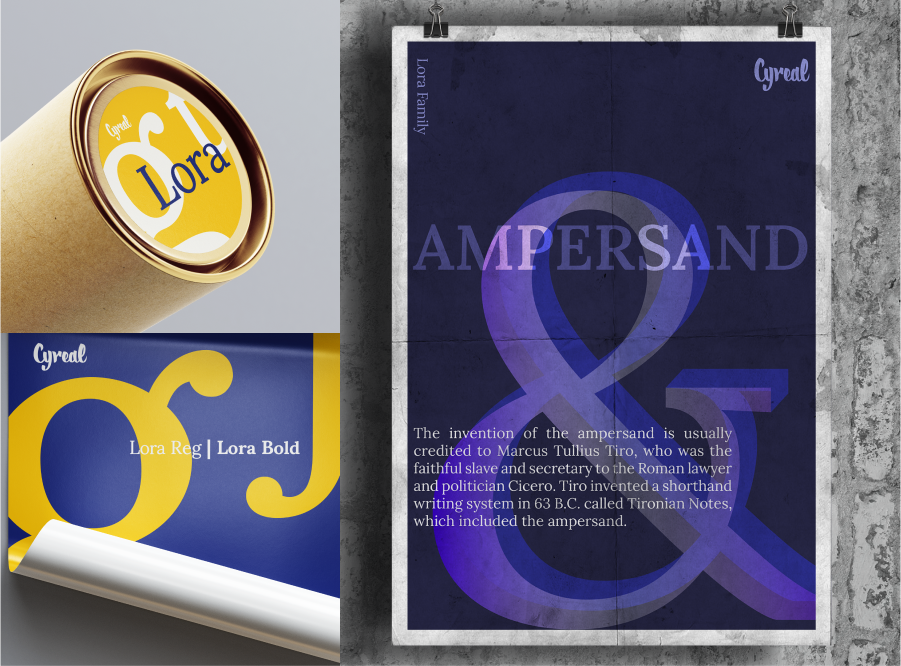

### Lora Fonts

#### by Olga Karpushina 
#### Cyrillic Extension: Alexei Vanyashin

and Lora project contributors

Lora is a well-balanced contemporary serif with roots in calligraphy. It is a text typeface with moderate contrast well suited for body text. A paragraph set in Lora will make a memorable appearance because of its brushed curves in contrast with driving serifs. The overall typographic voice of Lora perfectly conveys the mood of a modern-day story, or an art essay.

Technically Lora is optimised for screen appearance, and works equally well in print.

Designed by Olga Karpushina, and Alexei Vanyashin for Cyreal. Released in 2011 with contributions and assistance from Gayaneh Bagdasaryan. 

Lora is a Unicode typeface family that supports 
languages that use the Latin and Cyrillic scripts and its variants, and 
could be expanded to support other scripts.

Font Specimens by @mithilgorare

Project [information](http://www.cyreal.org/fonts/lora) on Cyreal Fonts' website:

### Variable Fonts
[Version 3.001](https://github.com/cyrealtype/Lora-Cyrillic/releases/tag/v3.001)
includes a variable font version with one weight axis.

### Cyrillic 

Cyrillic Extension designed by Alexei Vanyashin @alexeiva in May, 2013. 
Expansion to GF Cyrillic Plus, Pro, and locl has been completed by original author Olga Karpushina in August-September 2016.

### Vietnamese

Vietnamese glyphs were added by Nhung Nguyen @crystaltype

## Building

Fonts are built automatically by GitHub Actions - take a look in the "Actions" tab for the latest build.

If you particularly want to build fonts manually on your own computer, you will need to install the [`yq` utility](https://github.com/mikefarah/yq). On OS X with Homebrew, type `brew install yq`; on Linux, try `snap install yq`; if all else fails, try the instructions on the linked page.

Then:

* `make build` will produce font files.
* `make test` will run [FontBakery](https://github.com/googlefonts/fontbakery)'s quality assurance tests.
* `make proof` will generate HTML proof files.

## License

This Font Software is licensed under the SIL Open Font License, Version 1.1.
This license is copied below, and is also available with a FAQ at
http://scripts.sil.org/OFL

## Repository Layout

This font repository structure is inspired by [Unified Font Repository v0.3](https://github.com/unified-font-repository/Unified-Font-Repository), modified for the Google Fonts workflow.
