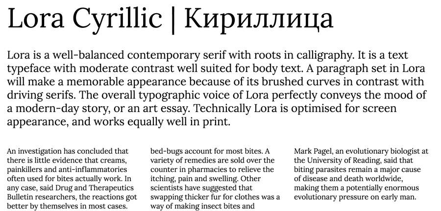

Lora is a well-balanced contemporary serif with roots in calligraphy. It is a text typeface with moderate contrast well suited for body text.
A paragraph set in Lora will make a memorable appearance because of its brushed curves in contrast with driving serifs. The overall typographic voice of Lora perfectly conveys the mood of a modern-day story, or an art essay.

Technically Lora is optimised for screen appearance, and works equally well in print.

Designed by Olga Karpushina, and Alexei Vanyashin for Cyreal.

Lora is a Unicode typeface family that supports 
languages that use the Latin and Cyrillic scripts and its variants, and 
could be expanded to support other scripts.

Cyrillic Extension designed by Alexei Vanyashin in May, 2013.

Project [information](http://www.cyreal.org/2012/07/lora/) on Cyreal Fonts' website:

