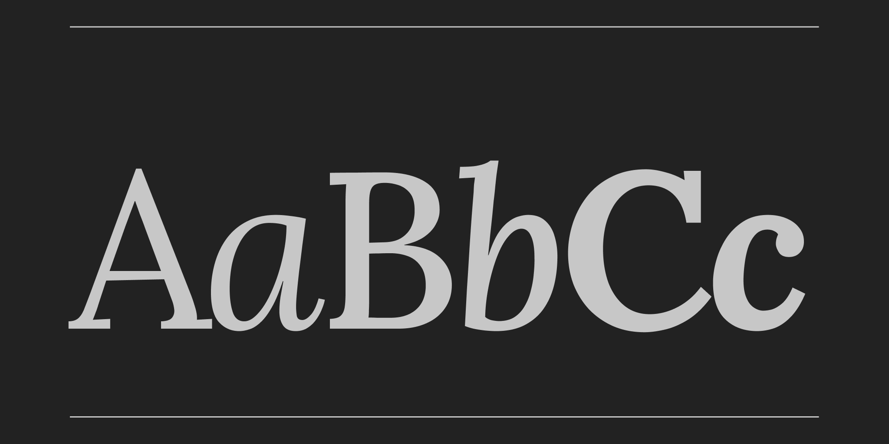
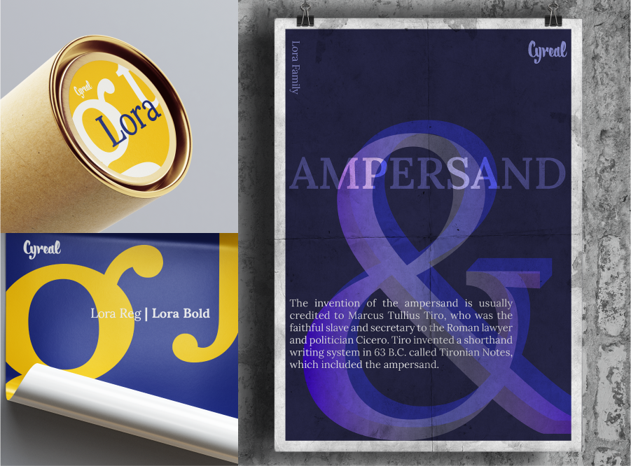
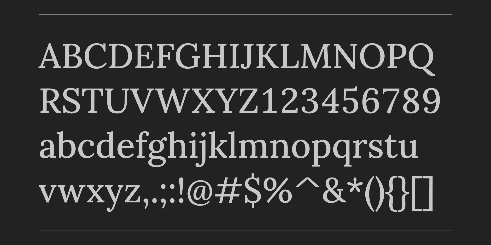
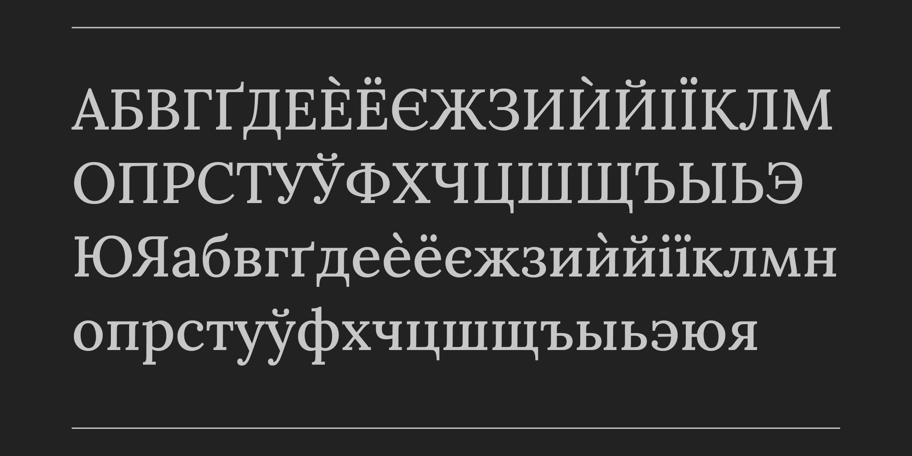

# Lora

[![][Fontspector]](https://alexeiva.github.io/OswaldFont/fontspector/fontspector-report.html)
[![][OpenType]](https://alexeiva.github.io/OswaldFont/fontspector/fontspector-report.html)
[![][Universal]](https://alexeiva.github.io/OswaldFont/fontspector/fontspector-report.html)
[![][Google Fonts]](https://alexeiva.github.io/OswaldFont/fontspector/fontspector-report.html)
[![][Glyphset]](https://alexeiva.github.io/OswaldFont/fontspector/fontspector-report.html)

[Fontspector]: https://img.shields.io/endpoint?url=https%3A%2F%2Falexeiva.github.io%2FOswald4%2Fbadges%2FFontspectorQA.json
[OpenType]: https://img.shields.io/endpoint?url=https%3A%2F%2Falexeiva.github.io%2FOswald4%2Fbadges%2FOpentypeSpecificationChecks.json
[Universal]: https://img.shields.io/endpoint?url=https%3A%2F%2Falexeiva.github.io%2FOswald4%2Fbadges%2FUniversalProfileChecks.json
[Google Fonts]: https://img.shields.io/endpoint?url=https%3A%2F%2Falexeiva.github.io%2FOswald4%2Fbadges%2FFontFileChecks.json
[Outline Correctness]: https://img.shields.io/endpoint?url=https%3A%2F%2Falexeiva.github.io%2FOswald4%2Fbadges%2FOutlineCorrectnessChecks.json
[Glyphset]: https://img.shields.io/endpoint?url=https%3A%2F%2Falexeiva.github.io%2FOswald4%2Fbadges%2FGlyphsetChecks.json

## About

#### by Olga Karpushina 
and Lora project contributors
#### Cyrillic Extension: Alexei Vanyashin @alexeiva

Lora is a well-balanced contemporary serif with roots in calligraphy. It is a text typeface with moderate contrast well suited for body text. A paragraph set in Lora will make a memorable appearance because of its brushed curves in contrast with driving serifs. The overall typographic voice of Lora perfectly conveys the mood of a modern-day story, or an art essay.

Technically Lora is optimised for screen appearance, and works equally well in print.

Designed by Olga Karpushina, and Alexei Vanyashin for Cyreal. Released in 2011 with contributions and assistance from Gayaneh Bagdasaryan. 

Lora is a Unicode typeface family that supports 
languages that use the Latin and Cyrillic scripts and its variants, and 
could be expanded to support other scripts.

Font Specimens by @mithilgorare

## Links

- [Lora](https://www.cyreal.org/fonts/lora) on Cyreal.org
- [Lora](https://fonts.google.com/specimen/Lora) on Google Fonts

## Building

Fonts are built automatically by GitHub Actions - take a look in the "Actions" tab for the latest build.

If you want to build fonts manually on your own computer:

- `make build` will produce font files.
- `make test` will run [FontBakery](https://github.com/googlefonts/fontbakery)'s quality assurance tests.
- `make proof` will generate HTML proof files.

The proof files and QA tests are also available automatically via GitHub Actions - look at `https://cyrealtype.github.io/Lora-Cyrillic`.

## Changelog

-- Variable Fonts
[Version 3.001](https://github.com/cyrealtype/Lora-Cyrillic/releases/tag/v3.001)
includes a variable font version with one weight axis.

-- Cyrillic 

Cyrillic Extension designed by Alexei Vanyashin @alexeiva in May, 2013. 
Expansion to GF Cyrillic Plus, Pro, and locl has been completed by original author Olga Karpushina in August-September 2016.

-- Vietnamese

Vietnamese glyphs were added by Nhung Nguyen @crystaltype

## License

This Font Software is licensed under the SIL Open Font License, Version 1.1.
This license is available with a FAQ at https://openfontlicense.org

## Repository Layout

This font repository structure is inspired by [Unified Font Repository v0.3](https://github.com/unified-font-repository/Unified-Font-Repository), modified for the Google Fonts workflow.
